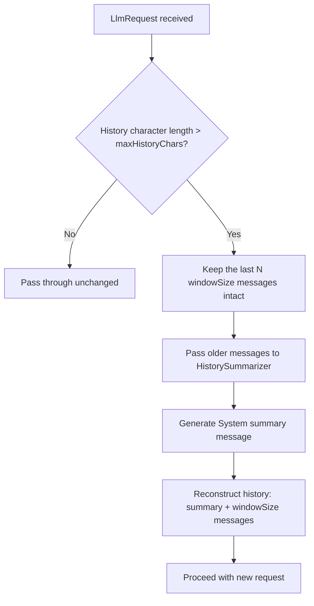

# Context Window Manager

The `ContextWindowManagerModule` is a pipeline module in the `polity4j-quality` module. It manages conversation history length dynamically by summarizing older messages as the conversation approaches the LLM's context window limit.

Unlike the `PromptOptimizerModule` which truncates history (discarding older turns entirely), the `ContextWindowManagerModule` condenses the older turns into a single summary message to **preserve conversation state and context**.

---

## Summarization Flow Diagram



---

## How It Works

1. **Evaluation**: Calculates the total character length of the role + content in the request's `conversationHistory`.
2. **Comparison**: If the character length is under `maxHistoryChars`, it is passed down the pipeline with zero allocations.
3. **Condensation**: If it exceeds the limit:
   - The most recent `windowSize` messages are kept intact.
   - All messages older than `windowSize` are passed to a pluggable `HistorySummarizer` to produce a single summary `LlmRequest.Message` (with the `system` role).
   - The final conversation history is formed by combining the summary message at index 0 followed by the preserved `windowSize` messages.

---

## Pluggable Summarization Strategies

You can choose between the default deterministic summarizer or plug in your own semantic, AI-backed summarizer.

### 1. Default: `DeterministicSummarizer`
A zero-dependency summarizer that doesn't make any external API calls. It extracts the shape of the conversation by taking the first 100 characters of each message and joining them:
```text
[Summary of earlier conversation: user: Hello..., assistant: Hi! How can I..., user: Can you code...]
```

### 2. Custom: AI-Based Summarizer
For high-quality semantic compression, implement the `HistorySummarizer` interface. For example, you can wrap a secondary model call to summarize the conversation:

```java
import io.polity4j.quality.context.HistorySummarizer;
import io.polity4j.core.LlmRequest;

HistorySummarizer aiSummarizer = messages -> {
    // 1. Convert messages list to summary prompt
    String summaryPrompt = "Summarize the following conversation context briefly:\n" + formatMessages(messages);
    
    // 2. Call a cheap/fast model to summarize
    String summaryText = callSummarizationModel(summaryPrompt);
    
    // 3. Return the system summary turn
    return new LlmRequest.Message("system", "[Summary of earlier conversation: " + summaryText + "]");
};
```

---

## Configuration

Configure the thresholds using `ContextWindowManagerConfig`:

```java
import io.polity4j.quality.context.ContextWindowManagerConfig;
import io.polity4j.quality.context.ContextWindowManagerModule;

ContextWindowManagerConfig config = ContextWindowManagerConfig.builder()
    .maxHistoryChars(4000)      // Summarize if history exceeds 4000 chars
    .windowSize(8)              // Always preserve the last 8 messages in full
    .summarizer(aiSummarizer)   // Use custom summarizer
    .build();

ContextWindowManagerModule manager = new ContextWindowManagerModule(config);
```
