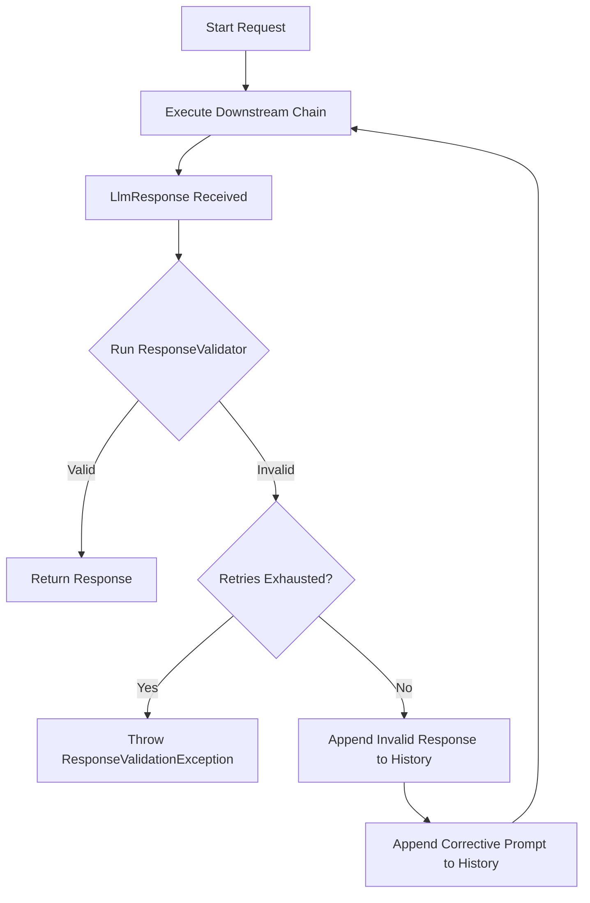

# Response Validator

The `ResponseValidatorModule` is a pipeline module in the `polity4j-quality` module. It enforces structural and semantic correctness on LLM responses. If a response fails validation, the module automatically feeds the error back to the LLM along with the invalid response, executing a corrective retry loop.

## How It Works

1. **Validation**: The module runs a user-defined `ResponseValidator` on the `LlmResponse`.
2. **Corrective Feedback**: If the response is invalid, the module appends the invalid response as an `assistant` message and the failure reason as a `user` message to the request's conversation history.
3. **Retry**: The module resends the corrected request downstream.
4. **Exhaustion**: If the response is still invalid after the configured maximum number of retries, the module throws a `ResponseValidationException` containing the final invalid content.

---

## Validation Flow Diagram



---

## Implementing a Validator

To use the module, implement the `ResponseValidator` functional interface. It returns a `ValidationResult` which is either successful or failed with a reason:

```java
import io.polity4j.quality.response.ResponseValidator;
import io.polity4j.quality.response.ValidationResult;

ResponseValidator jsonValidator = response -> {
    String content = response.content().trim();
    if (!content.startsWith("{") || !content.endsWith("}")) {
        return ValidationResult.failure("Response must be a valid JSON object starting with '{' and ending with '}'.");
    }
    return ValidationResult.success();
};
```

---

## Configuration

You can configure the maximum retry attempts and a default corrective prompt to use if the validator does not supply a specific reason.

```java
import io.polity4j.quality.response.ResponseValidatorConfig;
import io.polity4j.quality.response.ResponseValidatorModule;

ResponseValidatorConfig config = ResponseValidatorConfig.builder()
    .maxRetries(3) // Attempt up to 3 retries (4 calls total)
    .fallbackCorrectivePrompt("The response was invalid. Please rewrite it following the JSON schema.")
    .build();

ResponseValidatorModule validatorModule = new ResponseValidatorModule(jsonValidator, config);
```

---

## Exception Handling

If the retries are exhausted and the response remains invalid, a `ResponseValidationException` is thrown. This exception extends `PolityException` with HTTP status code `422` (Unprocessable Entity).

You can catch this exception to inspect the final invalid response content:

```java
import io.polity4j.core.exception.ResponseValidationException;

try {
    LlmResponse response = pipeline.send(request);
} catch (ResponseValidationException e) {
    System.err.println("Validation failed: " + e.getMessage());
    System.err.println("Final invalid content: " + e.invalidResponseContent());
}
```
